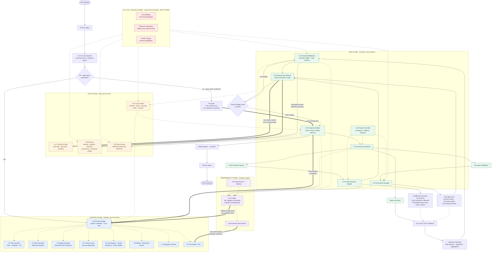
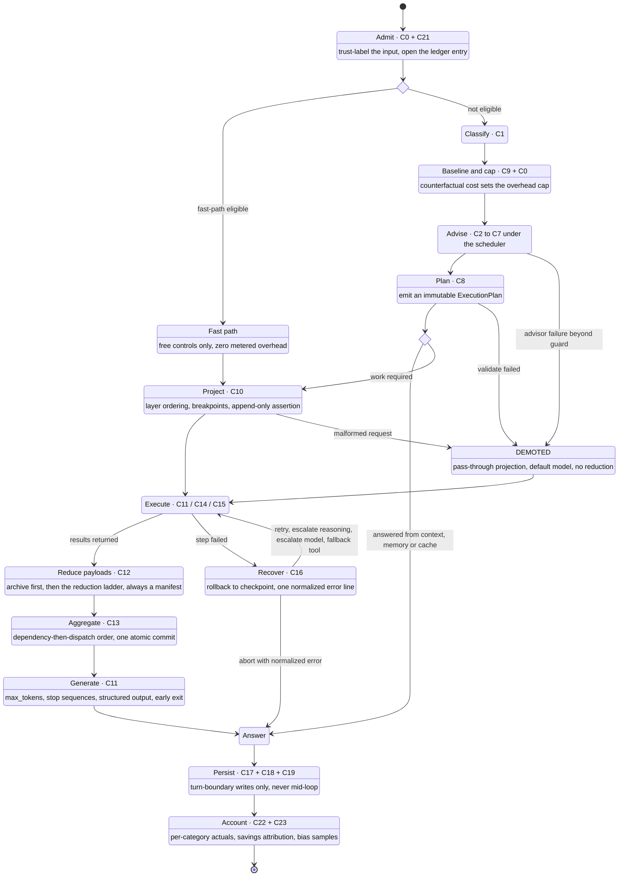
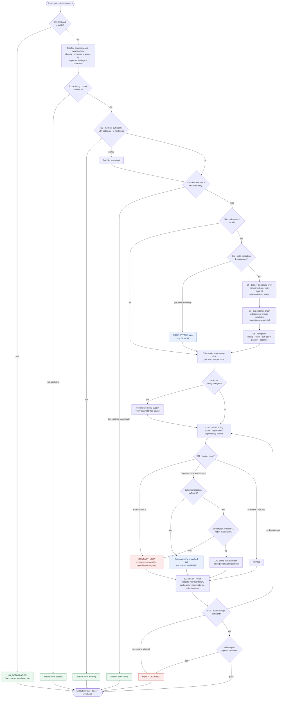
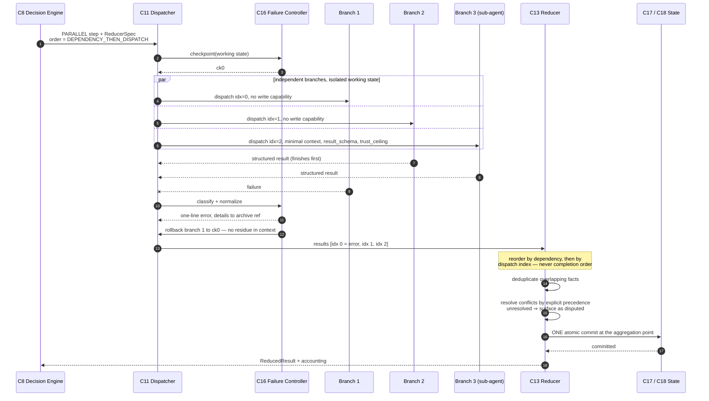
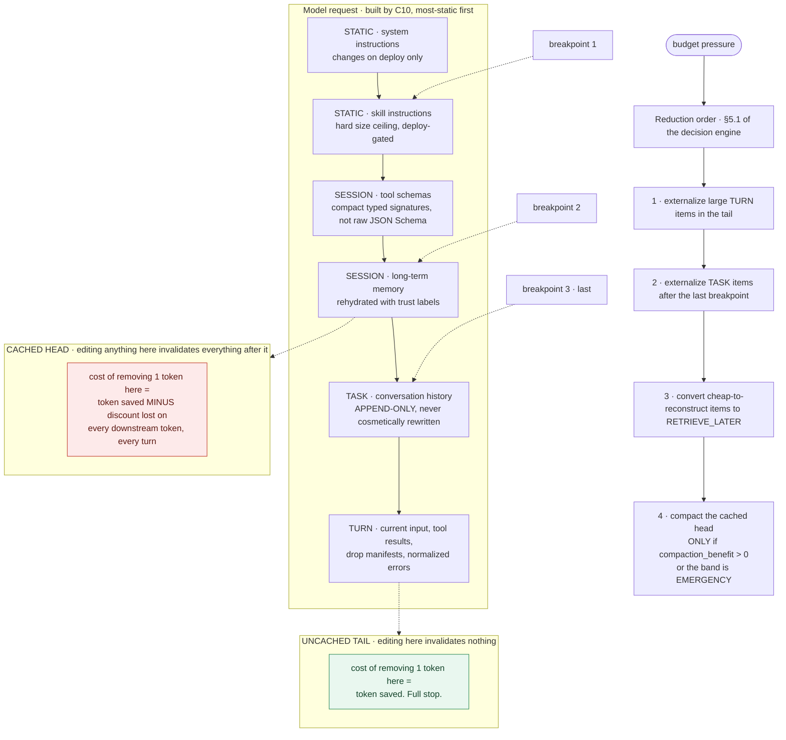
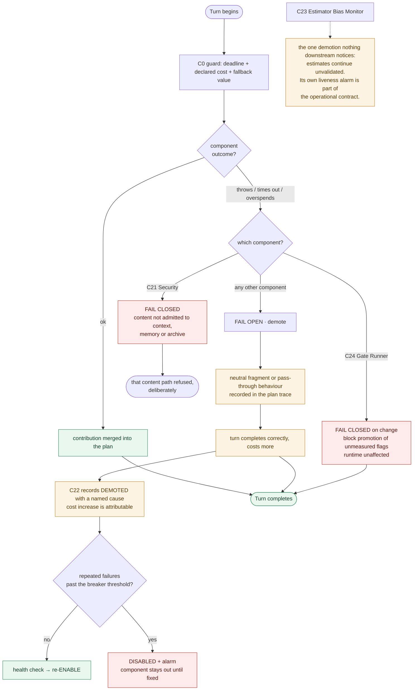

# §21 — Architectural Flow

**Stage 1 of 5.** Six diagrams covering the master architecture, the turn state machine, the decision
engine, the concurrency and reducer model, projection and cache layering, and failure demotion.

Companion documents: [`architecture.md`](architecture.md) (Deliverable 2),
[`decision-engine.md`](decision-engine.md) (§17).

---

## 1. Master architecture

Every component of the system, the three execution paths, and the state and observability planes they
depend on. Solid arrows are the request path; dotted arrows are consultation or accounting.

**Reading the diagram.** Three things are worth tracing explicitly:

* **The two heavy arrows into the state plane** are the only write paths. Everything else that
  touches state does so through a snapshot read.
* **The heavy arrow from the Ledger back into the Decision Engine** is the learning loop: realized
  savings per advisor, per workload class, are what the advisor scheduler ranks on. Without it the
  scheduler runs on hand-written priors forever.
* **`C12 → C19` is labelled "before reduction" deliberately.** The archive write happens first so
  that every drop-manifest entry has a real recovery path (INV-6).

---

## 2. Turn state machine

The twelve-phase turn, with the fast path, the early exits, and the demotion transitions.

The `Demoted` state is a **live** state, not an error state. Turns that pass through it complete
correctly and cost more, and the ledger records the demotion as a named cause so the cost increase is
attributable rather than mysterious.

---

## 3. Decision engine

Stages S0 to S16, with the short-circuit exits that make the cheap paths cheap.

The four green terminals on the left are the turns that cost almost nothing. A deployment where they
fire rarely is one where either the thresholds are miscalibrated or the workload genuinely requires
tools every turn — and `fast_path_blocked_by` in the decision telemetry distinguishes the two.

---

## 4. Concurrency and the deterministic reducer

Why parallel branches never touch shared state, and why the result does not depend on which branch
finishes first.

Step 12 is the property that makes multi-branch turns debuggable: rerun the same turn a thousand
times with branches completing in a thousand different orders and the committed state is identical.
Ordering by completion produces a system whose bugs cannot be reproduced, which on a stateful agent
is indistinguishable from a system that is simply wrong sometimes.

Note also that branch 1's failure leaves **nothing** behind. Its partial output is not summarized,
not mentioned, not retained "for context" — it is rolled back, and a single normalized line records
what happened. Partial output from a failed branch is one of the more effective ways to produce a
confidently wrong answer three turns later.

---

## 5. Projection layering and the cache boundary

What the model request is made of, where the cacheable prefix ends, and why reduction targets the
tail before the head.

The asymmetry between the two boxes is the whole point. A token in the tail and a token in the head
look identical in a token count and have completely different economics, and no amount of careful
scoring will find that difference if position relative to the cache breakpoint is not an input.

---

## 6. Failure and demotion

INV-2 as a control-flow diagram. Every optimizer component has a path back to a correct, more
expensive turn; two components deliberately fail closed instead.

Read the diagram as an availability argument: there is no path from an optimizer fault to a failed
turn. There are paths to an *expensive* turn, and every one of them is named in the ledger. The two
red terminals are the deliberate exceptions — a security control that fails open is not a control,
and a gate that fails open is not a gate.

---

## 7. Diagram index

| # | Diagram | Answers |
|---|---|---|
| 1 | Master architecture | What are the parts, and what talks to what? |
| 2 | Turn state machine | What happens, in what order, within one turn? |
| 3 | Decision engine | How is a single turn's plan decided, and where does it exit early? |
| 4 | Concurrency and reducer | Why is a multi-branch turn deterministic? |
| 5 | Projection and cache | Why does *where* a token sits matter more than how many there are? |
| 6 | Failure and demotion | What happens when the optimizer breaks? |
